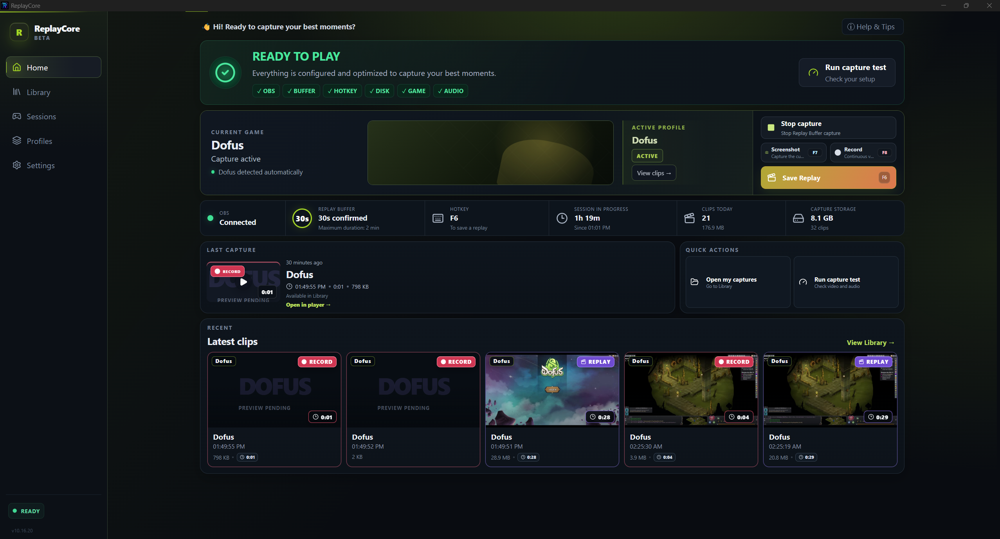
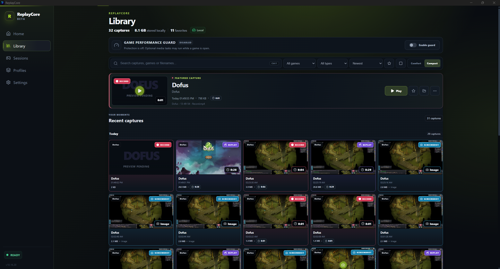
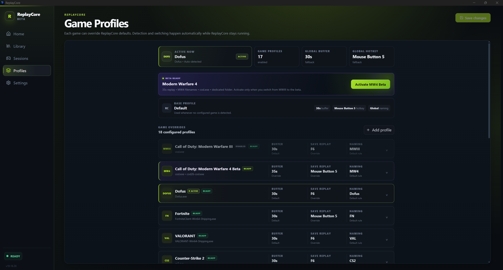
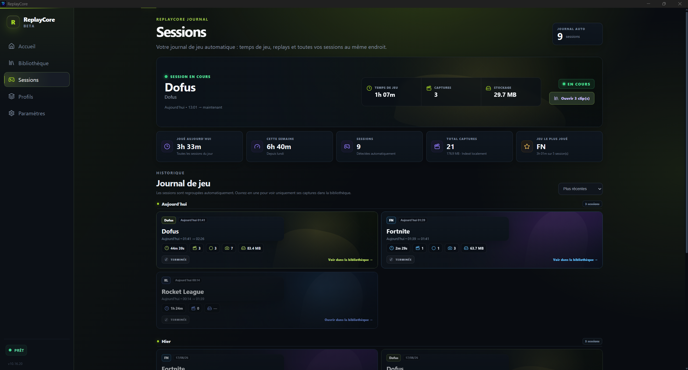

# ReplayCore

### Capture your best gaming moments. Instantly.

**Smart game capture, instant replay, screenshots and recording for Windows.**

ReplayCore brings the power of OBS to gamers through a simple, automated interface.

---

⚡ Instant Replay • 📸 Screenshots • ⏺ Recording • 🎮 Game Profiles

  

## ✨ What is ReplayCore?

ReplayCore is a Windows gaming capture application designed to make recording your best moments simple.

No need to constantly interact with OBS — ReplayCore automatically handles your capture environment so you can focus on playing.

## 🎮 Features

- ⚡ **Instant Replay** — Save the last moments of your gameplay instantly.
- 📸 **Screenshots** — Capture your game with a keyboard or mouse shortcut.
- ⏺ **Recording** — Start and stop recordings without opening OBS.
- 🎮 **Game Profiles** — Different capture settings for different games.
- 🗂️ **Session Tracking** — Automatically group play sessions and related captures.
- 🔄 **Automatic game detection**
- 🛠️ **OBS integration**
- 📚 **Built-in media library**
- ❤️ **Favorites**
- 🌐 **English & French**
- 🔔 **Desktop notifications**
- 🛡️ **Automatic capture recovery**

## 📸 Screenshots

Screenshots from the current ReplayCore beta.

### Library

Browse, filter and manage your captures from a clean built-in media library.

### Game Profiles

Use different replay, naming and shortcut rules for each game.

### Sessions

Automatically group your gameplay sessions, playtime and captures in one place.

## 🖥️ Designed for Windows

ReplayCore is currently developed for Windows gaming PCs.

## 📦 Download

ReplayCore is currently in development and testing.

The first public release will be available from the **Releases** section of this repository.

## 🧪 Development Status

ReplayCore is actively being developed and tested.

Feedback, bug reports and suggestions are welcome.

## 🔒 Security

ReplayCore is a capture tool built around OBS workflows.

It does not modify your games and is not a cheat or gameplay modification tool.

More information about builds, verification, hashes and security guidance will be provided with public releases.

---

### ReplayCore

**Play. Capture. Keep the moment.**

